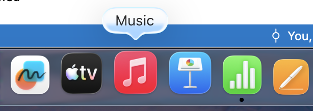
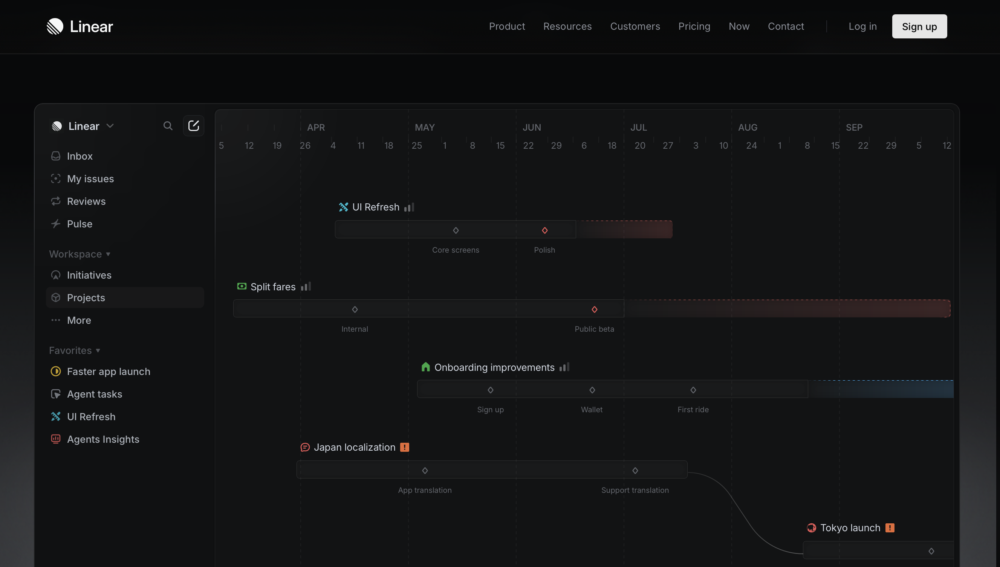
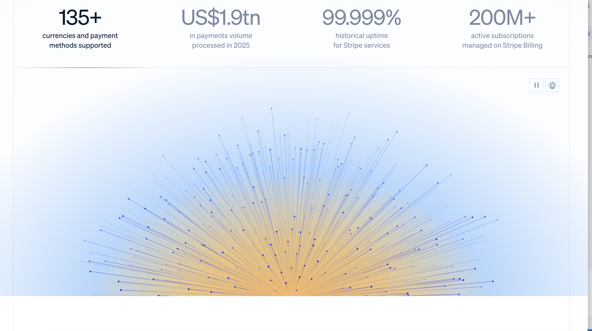

# Πίνακας Συγκριτικής Αξιολόγησης: SaaS Διαχείρισης Ακινήτων

| Εταιρεία               | Τιμή          | Χαρακτηριστικό 1 (Πίνακας ελέγχου) | Χαρακτηριστικό 2 (Ροή εργασίας) | Χαρακτηριστικό 3 (Αισθητική/UI) | Χαρακτηριστικό 4 (Ενσωματώσεις) | Καμπύλη Μάθησης | Χαρακτηριστικό 5 (Νομική Υποστήριξη/Εξώσεις) |
|------------------------|---------------|-----------------------|----------------------|--------------------------|--------------------------|----------------|-------------------------------------|
| Buildium               | $$            | Κάρτες KPI, feed ενεργειών | Ουρά μισθώσεων/πληρωμών | Καθαρό, επαγγελματικό   | Λογιστική, πληρωμές     | Μέτρια (1-2 μέρες) | Ενσωματωμένες διαδικασίες εξώσεων, πρότυπα νομικών ειδοποιήσεων, υπενθυμίσεις συμμόρφωσης |
| AppFolio               | $$$           | Σύνοψη χαρτοφυλακίου  | Τριάζ συντήρησης     | Πυκνό, μοντέρνο          | Marketing, screening     | Δύσκολη (2-4 μέρες) | Παρακολούθηση εξώσεων, βιβλιοθήκη νομικών εγγράφων, συνεργασίες |
| DoorLoop               | $             | Απλός πίνακας ελέγχου | Γρήγορες ενέργειες   | Φιλικό για αρχάριους     | Πληρωμές, έγγραφα        | Εύκολη (λίγες ώρες) | Βασικά πρότυπα ειδοποιήσεων, περιορισμένη νομική υποστήριξη |
| TenantCloud            | $             | Ενότητες ενοικιαστών/ενοικίων | Ροές μισθώσεων/πληρωμών | Μονάδες, καθαρό         | Μηνύματα, έγγραφα       | Μέτρια (1 μέρα) | Δημιουργία ειδοποιήσεων, κάποιες νομικές πηγές |
| Hemlane                | $$            | Εστίαση στη συντήρηση | Εισερχόμενα επικοινωνίας | Μίνιμαλ, ροή εργασίας   | Πληρωμές, επισκευές      | Μέτρια (1-2 μέρες) | Νομικές υπενθυμίσεις, πρόσβαση σε συνεργάτες δικηγόρους |
| Η Εφαρμογή μου         | $             | Βασικός πίνακας ελέγχου | Τυπικές ροές εργασίας | Προσαρμοσμένη, χρειάζεται βελτίωση | Stripe, email          | Εύκολη (λίγες ώρες) | Χειροκίνητη διαδικασία, σχεδιάζεται συνεργασία με λογιστή ή Law AI για νομική συμμόρφωση |
| Χειροκίνητη Διαχείριση | $             | Χωρίς πίνακα ελέγχου  | Ροή εργασίας με χαρτί/email | Καμία (χειροκίνητα)    | Καμία (χειροκίνητα)      | Δύσκολη (μέρες-εβδομάδες) | Ο ιδιοκτήτης χειρίζεται όλα τα νομικά βήματα, κίνδυνος λαθών |
| Διαχείριση από Λογιστή | $$            | Χωρίς πίνακα ελέγχου  | Ροή εργασίας λογιστή | Καμία (χειροκίνητα)      | Λογιστικό λογισμικό      | Δύσκολη (μέρες-εβδομάδες) | Μπορεί να βοηθήσει με τα έγγραφα, όχι με νομική συμμόρφωση |

## Σημειώσεις
- Τιμή: $ = οικονομικό, $$ = μέσο, $$$ = premium
- Τα χαρακτηριστικά είναι για γρήγορη σύγκριση. Μπορείτε να προσθέσετε πιο συγκεκριμένα χαρακτηριστικά αν θέλετε.
- Ο πίνακας είναι για ειλικρινή benchmarking, όχι για να φαίνεται η εφαρμογή σας καλύτερη.

## Πώς να χρησιμοποιήσετε
- Δείτε τα δυνατά σημεία κάθε ανταγωνιστή.
- Εντοπίστε κενά ή σημεία προς βελτίωση στη δική σας εφαρμογή.
- Χρησιμοποιήστε τους συνδέσμους που δόθηκαν για να μελετήσετε UI και χαρακτηριστικά για έμπνευση.

## 3 Ιδέες για αντιγραφή (UI/UX)
- Hover micro-interaction σε icons/κουμπιά (αντιγραφή από macos): όταν περνάει το ποντίκι, το στοιχείο κάνει μικρό zoom (π.χ. scale 1.05 για 150-200ms) για πιο δυναμική αίσθηση.
	
- Timeline-style γράφημα λήξης μισθώσεων (αντιγραφή από Linear): προβολή lease/rent expirations σε καθαρό timeline για άμεσο εντοπισμό λήξεων 30/60 ημερών και overdue ανανεώσεων.
	
- Αισθητική Stripe για premium UI (αντιγραφή από Stripe): καθαρή τυπογραφία, έντονο visual hierarchy, gradient λεπτομέρειες και ομαλά transitions για πιο σύγχρονη και επαγγελματική εμπειρία.
	
